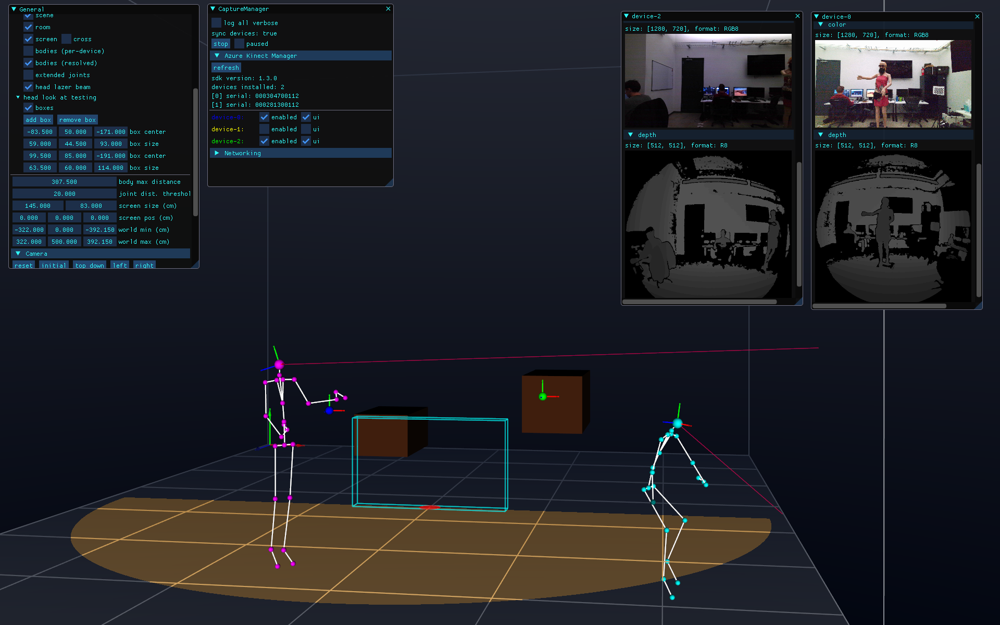

# Cinder-AzureKinect

Cinder support for the Microsoft Azure Kinect. Supports:

- Multiple cameras
- Multiple bodies
- Merging tracked bodies
- Netowrked cameras via socket.io (temporarily disabled)
- Depth and color buffers
- Debug render views and ImGui interface
- Experimental: Gesture tracking such as hand waiving and pointing.

## Setup

- Azure Kinect SDK: Get the latest Azure Kinect SDK from [here](https://github.com/microsoft/Azure-Kinect-Sensor-SDK/blob/develop/docs/usage.md) (latest tested: v1.4.1) for your supported platform.
  - if you use a different SDK, make sure to update the `K4A_SDK` path to reflect the version you are using.
- Azure Kinnect Body Tracking SDK - following instructions [here](https://learn.microsoft.com/en-us/azure/kinect-dk/body-sdk-download).

*note*: there is currently a project prebuild event that copies the necessary DLLs and other binary files to the application's build folder. If you don't install both SDKs mentioned above, you'll get an `xcopy` error when building from Visual Studio.


## Sample

Note that the sample currently lives in my mason repository due to dependencies there that I haven't yet taken care of.
You can find it [here](https://github.com/richardeakin/mason/tree/ck4a/test/AzureKinectTest).



## Debugging

To enable sdk logging, add these environment variables, either from command line or project `Properties -> Debugging -> Environment`.

```
K4A_ENABLE_LOG_TO_A_FILE=k4a.log
K4A_LOG_LEVEL=w
K4ABT_ENABLE_LOG_TO_A_FILE=k4abt.log
K4ABT_LOG_LEVEL=w
```

See Microsoft docs for details
- [troubleshooting](https://learn.microsoft.com/en-us/azure/kinect-dk/troubleshooting)
- [Error and event logging](https://microsoft.github.io/Azure-Kinect-Sensor-SDK/master/group___logging.html)
